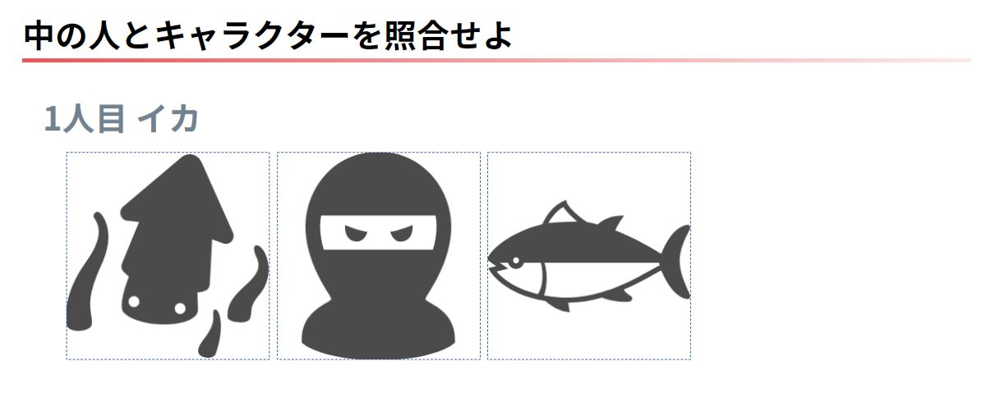

# actor-hit

キーワードに合致する画像を選択して何回当てられるかを試すミニゲームです。  
実行するにはキーワードとそれに該当する画像ファイルを用意する必要があります。

## ゲームのルール
* 3つ表示される画像からキーワードに合致するものを選択する
* 10回繰り返し、全て正解することが目標です

### 画面イメージ


### 設定例
キーワードと画像の組み合わせ例です。

* 花言葉と花の画像
* 市町村とイメージキャラクターの画像
* 声優名と担当しているキャラクター画像

## Requirements
* Go 1.11.1以上
* govendor 1.0.9以上
* PostgreSQL 9.6以上

## Installation
```bash
go get -u github.com/kardianos/govendor
```

```bash
govendor fetch +out
```

```bash
go run main.go
```

### DB
#### テーブル作成
`db/create` フォルダ以下のSQLを実行して以下の3テーブルを生成します。

* image
* result_log
* user_session

#### imageテーブルのレコード作成
|カラム|説明|
|---|---|
|name|一意になる任意の文字列|
|type|画像ファイルの種類(character or success or failure)、 `success` または `failure` は選択の成否を表すために使用されます|
|path|画像ファイル名|
|voice_actor|画面上に表示されるキーワード|

`type = character` の画像ファイルは `assets/image/character` フォルダ以下に  
`type = success or failure` の画像ファイルは `assets/image/icon` フォルダ以下に配置してください。


##### データ作成SQL例
```sql
INSERT INTO image(type, name, voice_actor, path)
VALUES
  ('character', 'イカ', 'イカ', 'ika.jpg'),
  ('character', 'ニンジャ', 'ニンジャ', 'ninja.jpg'),
  ('character', 'マグロ', 'マグロ', 'maguro.jpg'),
  ('success', 'success', 'success', 'success.jpg'),
  ('failure', 'failure', 'failure', 'failure.jpg')
```

### Environment Variables
以下の環境変数を設定してください。

|キー|説明|
|---|---|
|DB_HOST|PostgreSQLサーバーのIPアドレス|
|DB_PORT|PostgreSQLのポート番号|
|DB_USER|PostgreSQLのユーザー名|
|DB_PASSWORD|PostgreSQLのパスワード|
|DB_SCHEMA|PostgreSQLのデータベース名|
|DB_SSL|PostgreSQLにSSLモードで接続するか(とりあえず「disable」を指定しておく)|
|PORT|ginの実行ポート番号、指定しない場合は3000で起動します|
